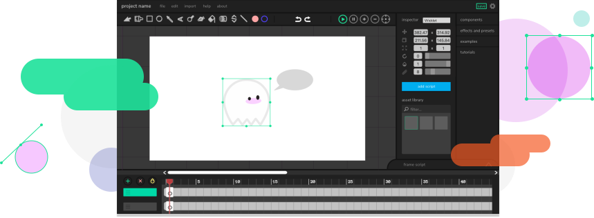

<h1>Particle Editor is a Fork of wick editor - Official Wick editor: https://github.com/Wicklets</h1>
<h1 align="center">
   
  
   
</h1>

  
  
  
  

<h1>Particle Editor</h1>

<h1>Remember this is still in Development, that's why you're not in the Editor Right Now. Releasing August 2026</h1>

The Wick Editor is a free and open-source tool for creating games, animations, and everything in-between. It's designed to be the most accessible tool for creating multimedia projects on the web.

Have fun hacking on Wick! 🎉

### Deploying to Production

To deploy, you'll need to have push access to this repo.

1) Test the production build by using `npm predeploy`

2) Run `npm run deploy`

### Deploying to Prerelease

1) Run `npm run prerelease-deploy`

## Support

## License

Wick Editor is under the GNU v3 Public License. See the [LICENSE](LICENSE.md) for more information.

## Links

* [Wick Editor Site](https://www.wickeditor.com) (**NOT OWENED BY FORKERS**)
* [Wick Editor Community Forum](https://forum.wickeditor.com/) (**Nice place, but, NOT OWENED BY FORKERS**)
* [Follow on Twitter](https://twitter.com/wickeditor) (**NOT OWENED BY FORKERS**)
* [Follow on Facebook](https://www.facebook.com/wickeditor/) (**NOT OWENED BY FORKERS**)

## Contributors

